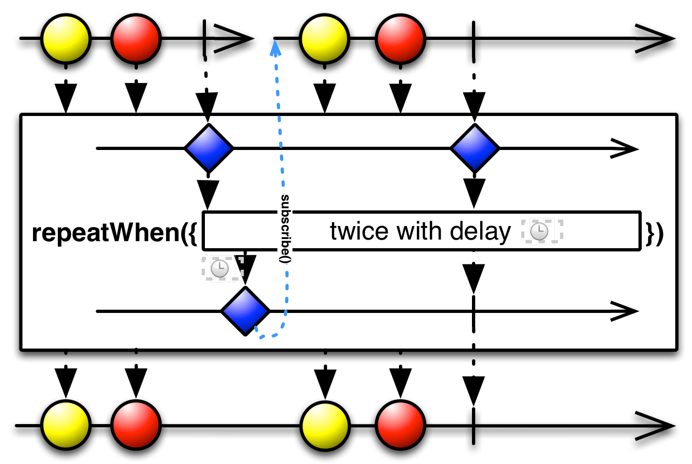
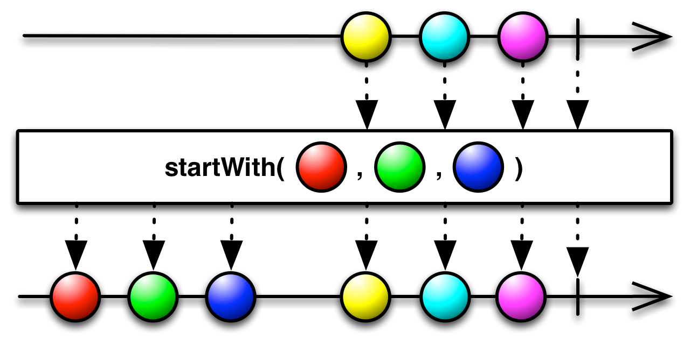
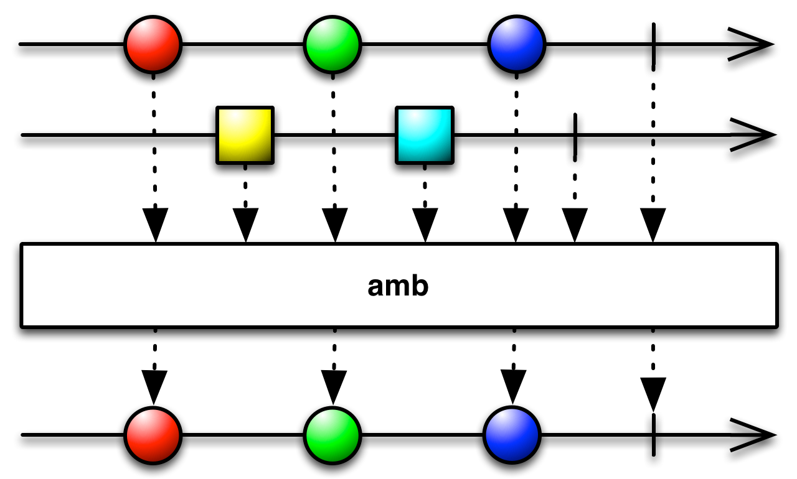
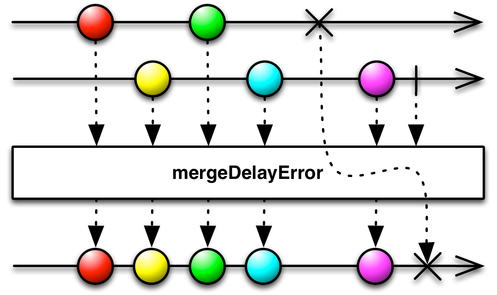
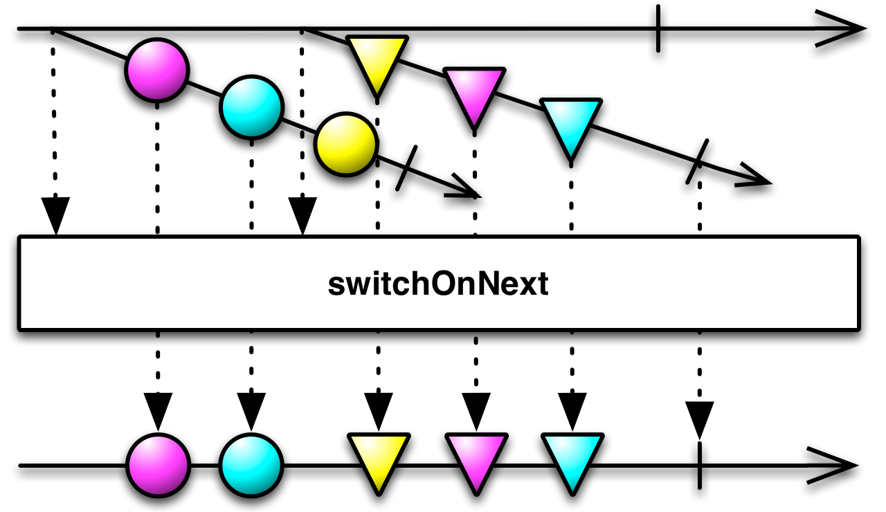
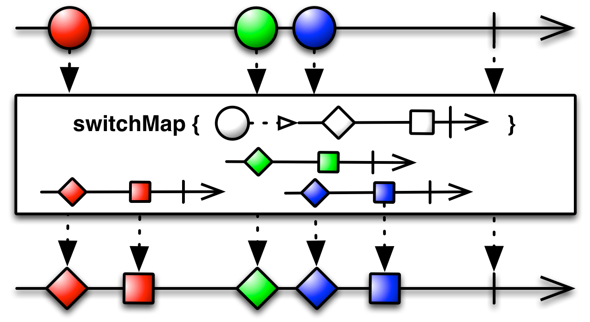
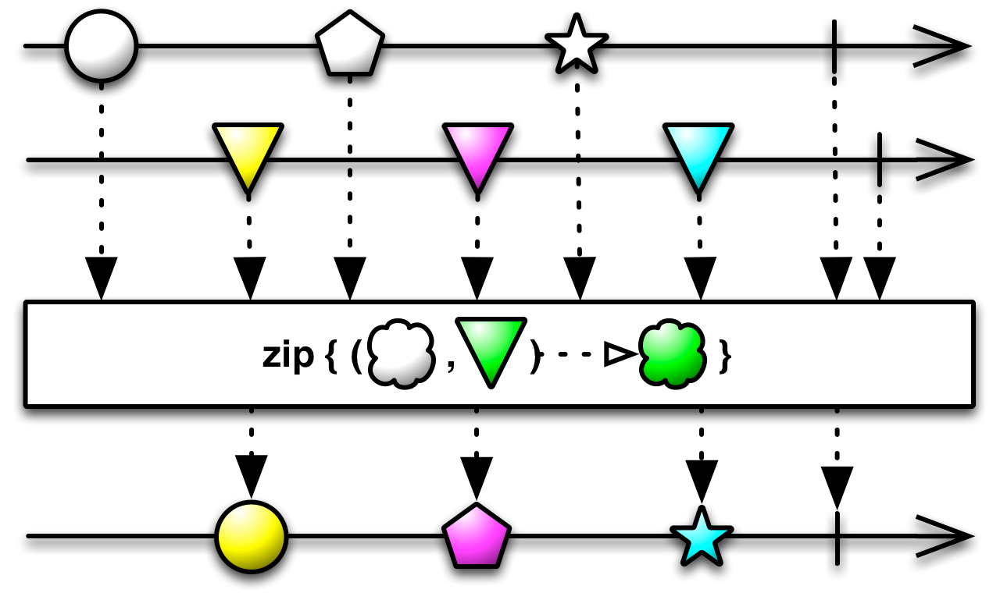

#组合数据流
到目前为止我们介绍了如何创建数据流以及如何把数据流中的数据转换成我们需要的数据。然而，大部分应用都需要处理多个数据源的数据。需要一种把多个数据源组合一起的方法。在前面的介绍中，也看到了一些数据流会使用多个 Observable。本节介绍如何把多个数据源的数据组合为一个数据源的操作函数。

##Concatenation

一个数据流发射完后继续发射下一个数据流是一种很常见的组合方法。
##concat

concat 操作函数把多个数据流按照顺序一个一个的发射数据。第一个数据流发射完后，继续发射下一个。 concat 函数有多个重载函数：

```Java

public static final <T> Observable<T> concat(
    Observable<? extends Observable<? extends T>> observables)
public static final <T> Observable<T> concat(
    Observable<? extends T> t1,
    Observable<? extends T> t2)
public static final <T> Observable<T> concat(Observable<? extends T> t1,
    Observable<? extends T> t2,
    Observable<? extends T> t3)
public static final <T> Observable<T> concat(Observable<? extends T> t1,
    Observable<? extends T> t2,
    Observable<? extends T> t3,
    Observable<? extends T> t4)
// All the way to 10 observables
```All the way to 10 observables
 

示例：
```Java

Observable<Integer> seq1 = Observable.range(0, 3);
Observable<Integer> seq2 = Observable.range(10, 3);

Observable.concat(seq1, seq2)
    .subscribe(System.out::println);
```

结果：
```Java

0
1
2
10
11
12
```

如果需要组合的数据流是动态的，则依然可以使用 concat 来组合返回多个 Observable 的情况。

下面的示例中，使用 groupBy 来把一个 Observable 中的数据流分组为多个 Observable ，这样 groupBy 返回的是多个 Observable， 然后使用 concat 把这些 动态生成的 Observable 给组合起来：

```Java

Observable<String> words = Observable.just(
    "First",
    "Second",
    "Third",
    "Fourth",
    "Fifth",
    "Sixth"
);

Observable.concat(words.groupBy(v -> v.charAt(0)))
    .subscribe(System.out::println);
```

结果：
```Java

First
Fourth
Fifth
Second
Sixth
Third
```

concat 的行为有点像 concatMap 操作函数的扁平处理（flattening phase）。事实上， concatMap 等价于 先应用 map 操作函数然后再使用 concat。
concatWith 函数是 concat 的另外一种使用方式，可以通过串联的方法来一个一个的组合数据流：
```Java

public void exampleConcatWith() {
    Observable<Integer> seq1 = Observable.range(0, 3);
    Observable<Integer> seq2 = Observable.range(10, 3);
    Observable<Integer> seq3 = Observable.just(20);

    seq1.concatWith(seq2)
        .concatWith(seq3)
        .subscribe(System.out::println);
}
```
 
结果：
```Java

0
1
2
10
11
12
20
```

##repeat

repeat 顾名思义，可以重复的发射自己。 repeat 不会缓存之前的数据，当再次发射数据的时候，会从新就算数据。
```Java

public final Observable<T> repeat()
public final Observable<T> repeat(long count)
```

示例：
```Java

Observable<Integer> words = Observable.range(0,2);

words.repeat(2)
    .subscribe(System.out::println);
```

结果：
```Java

0
1
0
1
```

 
##repeatWhen

repeatWhen 可以指定一个条件，当该条件满足的时候才重复发射数据流。条件为一个 Observable，当源Observable 结束的时候，会等待 条件 Observable 来发射数据通知源 Observable 重复发射数据流。如果条件 Observable 结束了，则不会触发源 Observable 重复发射数据。
有时候需要知道一个重复发射的数据量是何时结束的。repeatWhen 提供了一种特别的 Observable 在数据流结束的时候发射一个 Void。可以使用这个 Observable来当做一种信号。
```Java

public final Observable<T> repeatWhen(
    Func1<? super Observable<? extends java.lang.Void>,? extends Observable<?>> notificationHandler)
```



repeatWhen 的参数是一个函数，该函数的参数为 Observable 返回另外一个 Observable。这两个Observable 发射的数据类型是无关紧要的。输入的 Observable 用了表示重复结束的信号，返回的 Observable 用来表示重新开始的信号。
下一个示例使用 repeatWhen 来自己实现一个 repeat(n) ：
```Java

Observable<Long> values = Observable.interval(100, TimeUnit.MILLISECONDS);

values
    .take(2)
    .repeatWhen(ob -> {
        return ob.take(2);
    })
    .subscribe(new PrintSubscriber("repeatWhen"));
```

结果：
```Java

repeatWhen: 0
repeatWhen: 1
repeatWhen: 0
repeatWhen: 1
repeatWhen: Completed
```

上面的示例中，当重复发射完成后，ob 就立刻发射信号告诉源 Observable 重新发射。
下面的示例中，创建一个每隔两秒就重复一次的无限循环数据流：
```Java

Observable<Long> values = Observable.interval(100, TimeUnit.MILLISECONDS);

values
    .take(5)
    .repeatWhen((ob)-> {
        ob.subscribe();
        return Observable.interval(2, TimeUnit.SECONDS);
    })
    .subscribe(new PrintSubscriber("repeatWhen"));
```

注意上面的返回的条件 Observable 每隔两秒就发射一次信号。在后面会介绍更多关于时间控制的技巧。
另外一个需要注意的就是 ob.subscribe() 语句，看起来是多余的其实是必不可少的。这样会强制创建 ob 对象，当前 repeatWhen 的实现需要 ob 被订阅，否则是不会触发重复发射数据的。

##startWith

startWith 的参数为一个数据流，然后先发射该数据再发射 源 Observable 中的数据。
```Java

public final Observable<T> startWith(java.lang.Iterable<T> values)
public final Observable<T> startWith(Observable<T> values)
public final Observable<T> startWith(T t1)
public final Observable<T> startWith(T t1, T t2)
public final Observable<T> startWith(T t1, T t2, T t3)
// up to 10 values
```


```Java

Observable<Integer> values = Observable.range(0, 3);

values.startWith(-1,-2)
    .subscribe(System.out::println);
```

结果：
```Java

-1
-2
0
1
2
```

startWith 是使用 参数为 just 的 concat 函数的简写。
```Java

Observable.concat(
    Observable.just(-1,-2,-3),
    values)
// 和下面的是一样的效果
values.startWith(-1,-2,-3)
```

##并行数据流（Concurrent sequences）

Observable 并不总是在可预期的时间内发射数据。下面是一些用了组合并行 Observable 的操作函数。
##amb

amb 的参数为多个 Observable，使用第一个先发射数据的 Observable ，其他的 Observable 被丢弃。
```Java

public static final <T> Observable<T> amb(
    java.lang.Iterable<? extends Observable<? extends T>> sources)
public static final <T> Observable<T> amb(
    Observable<? extends T> o1,
    Observable<? extends T> o2)
public static final <T> Observable<T> amb(
    Observable<? extends T> o1,
    Observable<? extends T> o2,
    Observable<? extends T> o3)
// Up to 10 observables
```


```Java

Observable.amb(
        Observable.timer(100, TimeUnit.MILLISECONDS).map(i -> "First"),
        Observable.timer(50, TimeUnit.MILLISECONDS).map(i -> "Second"))
    .subscribe(System.out::println);
```

结果：
```Java

Second
```

由于第二个 Observable 先开始发射数据，所以第一个 Observable 被丢弃了， 使用 第二个 Observable。
该操作函数可以用于如下情况：
你有多个廉价的资源提供方，但是这些资源提供方返回数据的时间是不一样的。例如一个天气预报应用，可以从多个数据源获取数据，当其中一个数据源返回数据的时候，就丢弃其的请求，而使用这个数据源。
同样，还有一个 ambWith 版本的函数，可以通过链式调用每个 Observable。让代码看起来更优雅一些：

```Java

Observable.timer(100, TimeUnit.MILLISECONDS).map(i -> "First")
    .ambWith(Observable.timer(50, TimeUnit.MILLISECONDS).map(i -> "Second"))
    .ambWith(Observable.timer(70, TimeUnit.MILLISECONDS).map(i -> "Third"))
    .subscribe(System.out::println);
```

结果：
```Java

Second
```

##merge

merge 把多个 Observable 合并为一个，合并后的 Observable 在每个源Observable 发射数据的时候就发射同样的数据。所以多个源 Observable 的数据最终是混合是一起的：
```Java

public static final <T> Observable<T> merge(
    java.lang.Iterable<? extends Observable<? extends T>> sequences)
public static final <T> Observable<T> merge(
    java.lang.Iterable<? extends Observable<? extends T>> sequences,
    int maxConcurrent)
public static final <T> Observable<T> merge(
    Observable<? extends Observable<? extends T>> source)
public static final <T> Observable<T> merge(
    Observable<? extends Observable<? extends T>> source,
    int maxConcurrent)
public static final <T> Observable<T> merge(
    Observable<? extends T> t1,
    Observable<? extends T> t2)
public static final <T> Observable<T> merge(
    Observable<? extends T> t1,
    Observable<? extends T> t2,
    Observable<? extends T> t3)
...
```


示例：
```Java

Observable.merge(
        Observable.interval(250, TimeUnit.MILLISECONDS).map(i -> "First"),
        Observable.interval(150, TimeUnit.MILLISECONDS).map(i -> "Second"))
    .take(10)
    .subscribe(System.out::println);
```

结果：
```Java

Second
First
Second
Second
First
Second
Second
First
Second
First
```

concat 和 merge 的区别是，merge 不会等到前面一个 Observable 结束才会发射下一个 Observable 的数据，merge 订阅到所有的 Observable 上，如果有任何一个 Observable 发射了数据，则 就把该数据发射出来。同样 还有一个 mergeWith 函数用了串联调用。

```Java

Observable.interval(250, TimeUnit.MILLISECONDS).map(i -> "First")
    .mergeWith(Observable.interval(150, TimeUnit.MILLISECONDS).map(i -> "Second"))
    .take(10)
    .subscribe(System.out::println);
```


和上面输出的结果一样。

##mergeDelayError

merge 中如果任意一个源 Observable 出现错误了，则 merge 后的 Observable 也就出错并结束发射。使用 mergeDelayError 可以推迟发生的错误，继续发射其他 Observable 发射的数据。
```Java

public static final <T> Observable<T> mergeDelayError(
    Observable<? extends Observable<? extends T>> source)
public static final <T> Observable<T> mergeDelayError(
    Observable<? extends T> t1,
        Observable<? extends T> t2)
public static final <T> Observable<T> mergeDelayError(
    Observable<? extends T> t1,
    Observable<? extends T> t2,
    Observable<? extends T> t3)
...
```


```Java

Observable<Long> failAt200 = 
    Observable.concat(
        Observable.interval(100, TimeUnit.MILLISECONDS).take(2),
        Observable.error(new Exception("Failed")));
Observable<Long> completeAt400 = 
    Observable.interval(100, TimeUnit.MILLISECONDS)
        .take(4);

Observable.mergeDelayError(failAt200, completeAt400)
    .subscribe(
        System.out::println,
        System.out::println);
```

结果：
```Java

0
0
1
1
2
3
java.lang.Exception: Failed
```


上面的示例中，开始两个 Observable 都发射一样的数据，当发射第二个数据 1 后，第一个 Observable 抛出一个异常退出，而合并后的数据流继续发射直到所有的 Observable 完成或者也出现异常。
如果合并多个 Observable，则合并后的 Observable 只有当所有源 Observable 结束后才结束，如果有多个源 Observable 出现了异常，则合并后的 Observable 会用一个 CompositeException 来结束。
```Java

Observable<Long> failAt200 = 
Observable.concat(
    Observable.interval(100, TimeUnit.MILLISECONDS).take(2),
        Observable.error(new Exception("Failed")));
Observable<Long> failAt300 = 
    Observable.concat(
        Observable.interval(100, TimeUnit.MILLISECONDS).take(3),
        Observable.error(new Exception("Failed")));
Observable<Long> completeAt400 = 
    Observable.interval(100, TimeUnit.MILLISECONDS)
        .take(4);

Observable.mergeDelayError(failAt200, failAt300, completeAt400)
    .subscribe(
        System.out::println,
        System.out::println);
```

结果：
```Java

0
0
0
1
1
1
2
2
3
rx.exceptions.CompositeException: 2 exceptions occurred. 
```

##switchOnNext

switchOnNext 的参数为一个返回 Observable 对象的 Observable。也就是说，这个参数为一个 Observable， 但是这个 Observable 所发射的数据类型是 Observable 。switchOnNext 返回的 Observable 发射数据的规则如下：
在参数 Observable 返回的 Observable 中，把最先发射数据的 Observable 中的数据拿来转发，如果之后又有新的 Observable 开始发射数据了，则就切换到新的 Observable 丢弃前一个。

```Java

Observable.switchOnNext(
    Observable.interval(100, TimeUnit.MILLISECONDS)
        .map(i -> 
            Observable.interval(30, TimeUnit.MILLISECONDS)
                .map(i2 -> i)
        )
    )
    .take(9)
    .subscribe(System.out::println);
```

结果：
```Java

0
0
0
1
1
1
2
2
2
```

 
注意上面示例中 switchOnNext 的参数 每隔 100毫秒返回一个 Observable 。这个返回的 Observable 会每隔 30 毫秒发射一个数字，这个数字被映射为 100毫秒发射一个数据的 Observable 返回的数据。所以在第一个100毫秒的时候，switchOnNext 的参数返回的第一个 Observable 可以发射3个数据 0，然后到第100毫秒的时候，switchOnNext 的参数返回的第二个 Observable 开发发射数据1， 所以前一个发射数据 0 的 Observable 就被丢弃了， switchOnNext 切换到新的发射数据的 Observable。

###switchMap

就像 flatMap 内部使用 merge 来组合发射的数据；以及 concatMap 使用 concat 来组合数据，而 switchMap 内部使用 switchOnNext 来打散组合数据。

```Java

public final <R> Observable<R> switchMap(Func1<? super T,? extends Observable<? extends R>> func)
```


源 Observable 所发射的每一个数据都被 func 函数给转换为一个新的 Observable 了。每次只要 源Observable 发射一个数据，func 函数都把该数据转换为一个 Observable 然后 switchMap 返回的 Observable 就使用这个新的 Observable 来发射数据。
前面的示例也可以用 switchMap 实现：
```Java

Observable.interval(100, TimeUnit.MILLISECONDS)
    .switchMap(i -> 
        Observable.interval(30, TimeUnit.MILLISECONDS)
            .map(l -> i))
    .take(9)
    .subscribe(System.out::println);
```

结果：
```Java

0
0
0
1
1
1
2
2
2
```


##Pairing sequences

下面几个操作符用来把多个源 Observable 发射的数据组合成一个数据。
##zip

zip 是函数式编程中的一个基本概念，参数为多个源 Observable， 返回的结果是把这些源 Observable 发射的数据按照顺序给组合起来。


下面的示例中，有两个源 Observable 发射数据的速度是不一样的。
```Java

Observable.zip(
        Observable.interval(100, TimeUnit.MILLISECONDS)
            .doOnNext(i -> System.out.println("Left emits " + i)),
        Observable.interval(150, TimeUnit.MILLISECONDS)
            .doOnNext(i -> System.out.println("Right emits " + i)),
        (i1,i2) -> i1 + " - " + i2)
    .take(6)
    .subscribe(System.out::println);
```

结果：
```Java

Left emits 0
Right emits 0
0 - 0
Left emits 1
Right emits 1
Left emits 2
1 - 1
Left emits 3
Right emits 2
2 - 2
Left emits 4
Left emits 5
Right emits 3
3 - 3
Left emits 6
Right emits 4
4 - 4
Left emits 7
Right emits 5
Left emits 8
5 - 5
```

从上面示例中可以看到，zip 是按照顺序来组合数据的。
zip 有很多重载函数可以接受多个 Observable ：
```Java

public static final <R> Observable<R> zip(
    java.lang.Iterable<? extends Observable<?>> ws,
    FuncN<? extends R> zipFunction)
public static final <R> Observable<R> zip(
    Observable<? extends Observable<?>> ws,
    FuncN<? extends R> zipFunction)
public static final <T1,T2,R> Observable<R> zip(
    Observable<? extends T1> o1,
    Observable<? extends T2> o2,
    Func2<? super T1,? super T2,? extends R> zipFunction)
public static final <T1,T2,T3,R> Observable<R> zip(
    Observable<? extends T1> o1,
    Observable<? extends T2> o2,
    Observable<? extends T3> o3,
    Func3<? super T1,? super T2,? super T3,? extends R> zipFunction)
/// etc
```
如何有多个 源 Observable，则 zip 会等待最慢的一个 Observable 发射完数据才开始组合这次发射的所有数据。
```Java

Observable.zip(
        Observable.interval(100, TimeUnit.MILLISECONDS),
        Observable.interval(150, TimeUnit.MILLISECONDS),
        Observable.interval(050, TimeUnit.MILLISECONDS),
        (i1,i2,i3) -> i1 + " - " + i2 + " - " + i3)
    .take(6)
    .subscribe(System.out::println);
```

结果：
```Java

0 - 0 - 0
1 - 1 - 1
2 - 2 - 2
3 - 3 - 3
4 - 4 - 4
5 - 5 - 5
```

zip 的任意一个源 Observable 结束标示着 zip 的结束。其他源 Observable 后续发射的数据被忽略了。 下面的例子组合三个 Observable，然后统计下 zip 返回的 Observable 发射了多少个数据：
```Java

Observable.zip(
        Observable.range(0, 5),
        Observable.range(0, 3),
        Observable.range(0, 8),
        (i1,i2,i3) -> i1 + " - " + i2 + " - " + i3)
    .count()
    .subscribe(System.out::println);
```

结果：
```Java

3
```

 
所以 zip 返回的Observable发射的速度和最慢的那个 Observable 一样，发射的数据和发射最少数据的 那个 Observable 一样。
zip 还有一个 zipWith 操作函数：
```Java

Observable.interval(100, TimeUnit.MILLISECONDS)
    .zipWith(
        Observable.interval(150, TimeUnit.MILLISECONDS), 
        (i1,i2) -> i1 + " - " + i2)
    .take(6)
    .subscribe(System.out::println);
```

结果：
```Java

0 - 0
1 - 1
2 - 2
3 - 3
4 - 4
5 - 5
```

zipWidth 还可以使用一个 iterable 为参数：
```Java

Observable.range(0, 5)
    .zipWith(
        Arrays.asList(0,2,4,6,8),
        (i1,i2) -> i1 + " - " + i2)
    .subscribe(System.out::println);
```

结果：
```Java

0 - 0
1 - 2
2 - 4
3 - 6
4 - 8
```

##combineLatest

前面的 zip 使用源 Observable 发射的顺序为组合的标记，而 combineLatest 使用的是时间。只要 combineLatest 的任何一个源 Observable 发射数据，则就使用该数据和其他Observable 最后一次发射的数据去组合。
#[image](image/rxcombineLatest.png)
```Java

Observable.combineLatest(
        Observable.interval(100, TimeUnit.MILLISECONDS)
            .doOnNext(i -> System.out.println("Left emits")),
        Observable.interval(150, TimeUnit.MILLISECONDS)
            .doOnNext(i -> System.out.println("Right emits")),
        (i1,i2) -> i1 + " - " + i2
    )
    .take(6)
    .subscribe(System.out::println);
```

结果：
```Java

Left emits
Right emits
0 - 0
Left emits
1 - 0
Left emits
2 - 0
Right emits
2 - 1
Left emits
3 - 1
Right emits
3 - 2
```

combineLatest 一开始等待所有的源 Observable 发射第一个数据，然后只要有任意一个 Observable 发射数据，就用这个数据和其他 Observable 最后一次发射的数据组合。
combineLatest 同样有多个重载函数可以组合多个源 Observable。 combineLatest 使用场景是只要有一个条件变化了就需要重新计算当前的数据或者状态。比如在用markdown 写博客的时候，编辑器里面有个控制按钮为把单词的每个字母转换为大写字母的开关，输入框旁边有个预览界面。每当你在编辑框中输入内容或者改变大小写状态的时候，combineLatest 就用输入框和大小写状态的最新的值来重新渲染预览界面。

