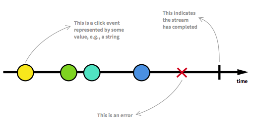
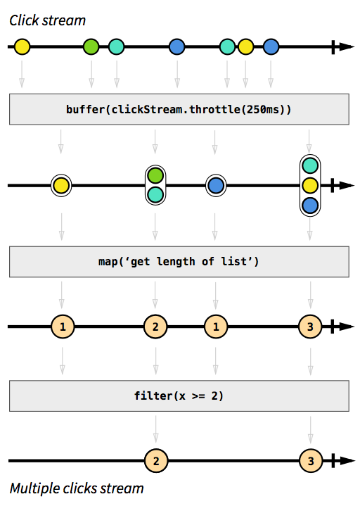

#01.函数式响应式概念和思想
##一、响应式编程(Reactive Programming)
- RP是使用异步数据流进行编程(asynchronous and event-based programs)
- everything is stream
- Stream廉价且常见，任何东西都可以是一个Stream：变量、用户输入、属性、Cache、数据结构等等。举个例子，想像一下你点击屏幕，Click events那样的Data stream，你可以监听它并相应的作出响应。

 

 

https://github.com/reactive-streams/reactive-streams-jvm/blob/v1.0.0/README.md#specification

##二、函数式编程（Functional programming）
摘取一下Wiki上对Functional Programming的定义：

>In computer science, functional programming is a programming paradigm that treats computation as the evaluation of mathematical functions and avoids state and mutable data.
>函数式编程是一种编程模型，他将计算机运算看做是数学中函数的计算，并且避免了状态以及变量的概念。 

Functional programming是一种编程范式，如同面向对象一样，这是一个关于我们思考方式的问题，而不是我们要做什么的问题。

在面向对象的世界里，我们把要解决的问题抽象成一个个类，通过类之间通信解决问题。而functional programming则是通过函数来描述我们要解决的问题和解决方案。我们管这样的函数，叫做Mathematical functions。而平实我们开发中编写的函数叫做computational functions。它们有什么区别呢？

它们最本质的区别是：Computational function是一组完成特定任务指令的封装，关乎的是要完成的任务；而Mathematical function关注的则是描述参数和返回值之间的关系。通过这种关系，确定的一个参数将总是有固定的返回值。

在函数式中，函数是一等公民，函数能作为变量的值，函数可以是另一个函数的参数，函数可以返回另一个函数等等。

###纯函数
最喜欢纯函数了，什么是纯函数呢？
>A pure function is a function whose return value is only determined by its input,
without observable side effects. If we call it with the same parameters n times, we are
going to get the same result every single time 
>纯函数返回值只由它的输入决定，中间过程没有副作用，如果使用相同的参数调用，不管执行多少次，都是得到相同的结果。

纯函数有三个重要的点：

- 函数的结果只受函数参数影响。
- 函数内部不使用能被外部函数影响的变量。
- 函数的结果不影响外部变量。
这有什么好处呢？当你有一堆函数对某个数据进行操作的时候，就能轻松定位到哪些函数出了问题。
Complex programs can't be composed only of pure functions, but whenever it is
possible, it is good to use them. 

###不可变（immutability）

变量或者结构在定义之后不能再发生值的变动，所有操作只是产生新的值而不是去覆盖之前的变量。这样去控制数据，能够让数据流动更加可控。
A good example is the String class in Java.
The String instances cannot be changed; even methods such as substring create a
new instance of String without modifying the calling one
(String、autovalue、gavua immutable list、tuple)

###高阶函数(Higher-order function)

把函数作为参数传入，这样的函数称为高阶函数，函数式编程就是指这种高度抽象的编程范式

##三、流
为了展示RP真正的实力，让我们假设你想得到一个包含双击事件的Stream。为了让它更加有趣，假设我们想要的这个Stream要同时考虑三击(Triple clicks)，或者更加宽泛，连击(Multiple clicks)。深呼吸一下，然后想像一下在传统的命令式且带状态的方式中你会怎么实现。我敢打赌代码会像一堆乱麻，并且会使用一些的变量保存状态，同时也有一些计算时间间隔的代码。
而在RP中，这个功能的实现就非常简单。事实上，这逻辑只有 4行代码 。但现在我们先不管那些代码。用图表的方式思考是理解怎样构建Stream的最好方法，无论你是初学者还是专家。

为什么我要使用RP

RP提高了代码的抽象层级，所以你可以只关注定义了业务逻辑的那些相互依赖的事件，而非纠缠于大量的实现细节。RP的代码往往会更加简明。

特别是在开发现在这些有着大量与Data events相关的UI events的高互动性Webapps、Mobile apps的时候，RP的优势将更加明显。

> 在学习过程中最困难的一部分是 以RP的方式思考 。这意味着要放弃命令式且带状态的(Imperative and stateful)编程习惯，并且要强迫你的大脑以一种不同的方式去工作。
