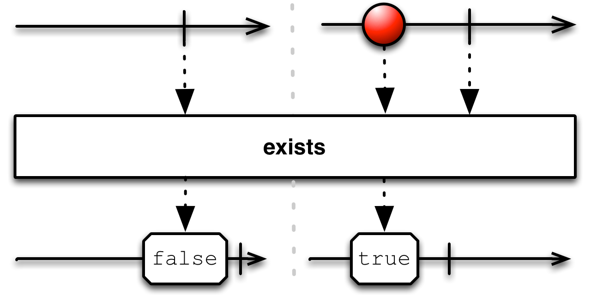
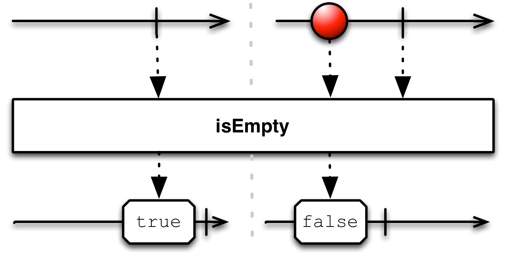
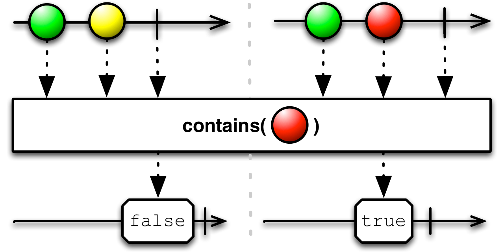
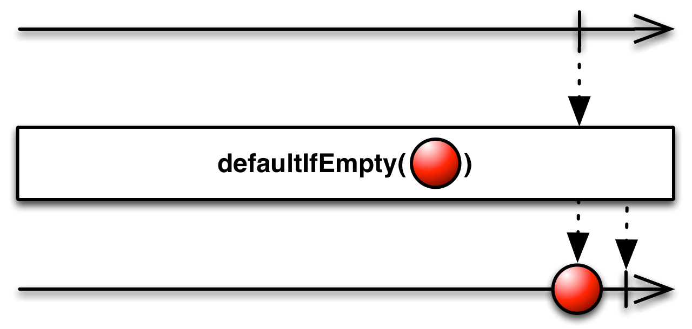

#Inspection 

检查数据是否符合某一条件
有时候我们需要了解该数据流中的数据是否符合某一条件。

##all

all 函数用来判断 observable 中发射的所有数据是否都满足一个条件。
```Java

public final Observable<java.lang.Boolean> all(Func1<? super T,java.lang.Boolean> predicate)
```

```Java

Observable<Integer> values = Observable.create(o -> {
    o.onNext(0);
    o.onNext(10);
    o.onNext(10);
    o.onNext(2);
    o.onCompleted();
});


Subscription evenNumbers = values
    .all(i -> i % 2 == 0)
    .subscribe(
        v -> System.out.println(v),
        e -> System.out.println("Error: " + e),
        () -> System.out.println("Completed")
    );
```

结果：
```Java

true
Completed
```

all 函数返回的是一个发射一个 布尔值的 Observable，而不是直接返回一个 布尔值。原因在于我们并不知道源 Observable 何时才结束数据流的发射，只有当源 Observable 发射结束的时候， all 函数才知道结果是否都满足条件。只要遇到一个不满足条件的数据，all 函数就立刻返回 false。 只有当源 Observable 结束发射并且所发射的所有数据都满足条件的时候才会产生 true。在 observable 内返回结果可以方便的实现非阻塞操作。 在下个示例中可以看到 all 在遇到不满足的数据的时候就立刻结束了。
```Java
Observable<Long> values = Observable.interval(150, TimeUnit.MILLISECONDS).take(5);

Subscription subscription = values
    .all(i -> i<3) // Will fail eventually
    .subscribe(
        v -> System.out.println("All: " + v),
        e -> System.out.println("All: Error: " + e),
        () -> System.out.println("All: Completed")
    );
Subscription subscription2 = values
    .subscribe(
        v -> System.out.println(v),
        e -> System.out.println("Error: " + e),
        () -> System.out.println("Completed")
    );
```

结果：
```Java

0
1
2
All: false
All: Completed
3
4
Completed
```

 
如果源 Observable 出现了错误，则 all 操作就没有意义了，all 会直接发射一个 error 然后结束。
```Java

Observable<Integer> values = Observable.create(o -> {
    o.onNext(0);
    o.onNext(2);
    o.onError(new Exception());
});

Subscription subscription = values
    .all(i -> i % 2 == 0)
    .subscribe(
        v -> System.out.println(v),
        e -> System.out.println("Error: " + e),
        () -> System.out.println("Completed")
    );
```

结果：
```Java

Error: java.lang.Exception
```


如果源 Observable 在出错之前就发射了一个不满足条件的数据，则 源 Observable 的错误对 all 没有影响（ all 遇到不满足条件的数据就结束了，结束的Observable 无法再继续发射数据了）。
```Java

Observable<Integer> values = Observable.create(o -> {
    o.onNext(1);
    o.onNext(2);
    o.onError(new Exception());
});

Subscription subscription = values
    .all(i -> i % 2 == 0)
    .subscribe(
        v -> System.out.println(v),
        e -> System.out.println("Error: " + e),
        () -> System.out.println("Completed")
    );
```

结果：
```Java

false
Completed
```
###exists

如果源 exists 发射的数据中有一个满足条件，则 exists 就返回 true。 exists 和 all 一样也是返回一个 Observable 而不是直接返回 布尔值。


```Java

Observable<Integer> values = Observable.range(0, 2);

Subscription subscription = values
    .exists(i -> i > 2)
    .subscribe(
        v -> System.out.println(v),
        e -> System.out.println("Error: " + e),
        () -> System.out.println("Completed")
    );
```

结果：
```Java

false
Completed
```

 
上面示例中只发射了 0 和1 两个数据，而这两个数据都不满足大于2的条件，所以返回结果为 false。
如果我们多发射几个数据，则就会满足条件了。
```Java

Observable<Integer> values = Observable.range(0, 4);
```
结果：
```Java

true
Completed
```

###isEmpty

顾名思义，判断一个 Observable 是否是空的，也就是没有发射任何数据就结束了。

```Java

Observable<Long> values = Observable.timer(1000, TimeUnit.MILLISECONDS);

Subscription subscription = values
    .isEmpty()
    .subscribe(
        v -> System.out.println(v),
        e -> System.out.println("Error: " + e),
        () -> System.out.println("Completed")
    );
```

 
结果：
```Java

false
Completed
```

只要源 Observable 发射了一个数据，isEmpty 就立刻返回 false， 只有当源 Observable 完成了并且没有发射数据，isEmpty 才返回 true。


##contains

contains 使用 Object.equals 函数来判断源 Observable 是否发射了相同的数据。
只要遇到相同的数据，则 contains 就立刻返回。

```Java

Observable<Long> values = Observable.interval(100, TimeUnit.MILLISECONDS);

Subscription subscription = values
    .contains(4L)
    .subscribe(
        v -> System.out.println(v),
        e -> System.out.println("Error: " + e),
        () -> System.out.println("Completed")
    );
```

结果：
```Java

true
Completed
```

 
注意上面使用的是 contains(4L)， 而不是 contains(4)， 由于 values 是 Observable 类型的， 所以需要使用 Long 类型而不能是 Integer 类型。
如果使用 contains(4) 则什么都不会打印出来， 由于 values 是一个无限的数据流，所以 contains 一直在等待一个相同的数据发射出来，但是在 values 里面是没有一样的数据的，导致 contains 一直等待下去。

##defaultIfEmpty

如果你不想单独处理没有发射任何数据的情况（需要用 isEmpty 函数来检查是否为空），则可以使用 defaultIfEmpty 函数来强制一个空的 Observable 发射一个默认数据。

```Java

Observable<Integer> values = Observable.empty();

Subscription subscription = values
    .defaultIfEmpty(2)
    .subscribe(
        v -> System.out.println(v),
        e -> System.out.println("Error: " + e),
        () -> System.out.println("Completed")
    );
```

 
结果：
```Java

2
Completed
```

只有当 onCompleted 事件发生了，并且 Observable 没有发射任何数据的时候，才会使用默认值；否则不会使用默认值。 如果发生了错误，则还会有错误的结果。
```Java

Observable<Integer> values = Observable.error(new Exception());

Subscription subscription = values
    .defaultIfEmpty(2)
    .subscribe(
        v -> System.out.println(v),
        e -> System.out.println("Error: " + e),
        () -> System.out.println("Completed")
    );
```

 
结果：

```Java

Error: java.lang.Exception
```
